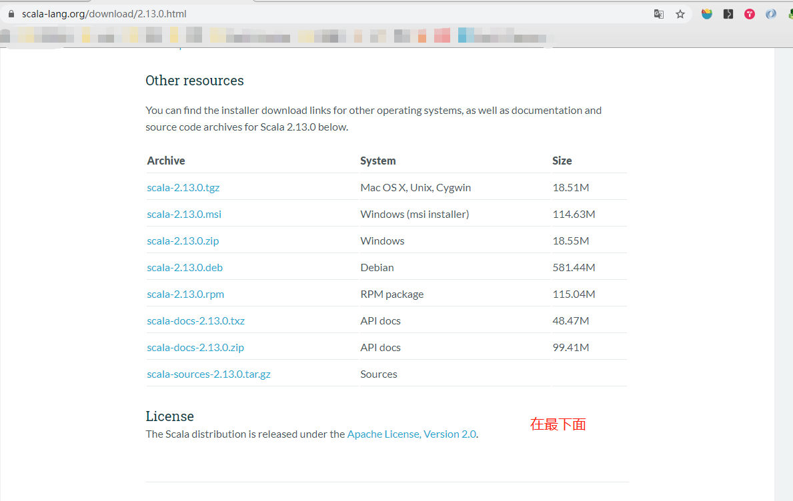
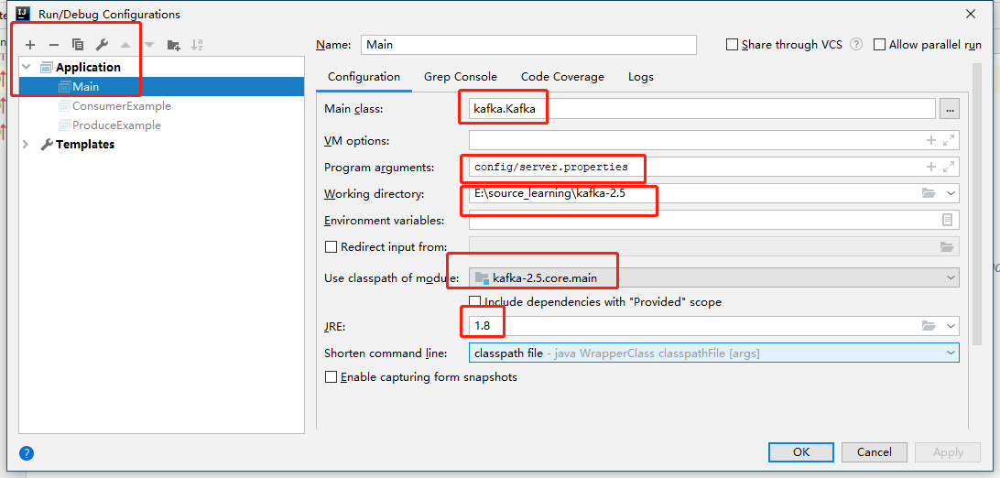

**kafka2.5源码学习**

一、开发环境搭建

- 本人系统：window10
- java版本：1.8
- scala版本：2.12.10  （下载地址：https://www.scala-lang.org/download/all.html， 翻墙打开会更快，解压后直接将bin添加到path，便完成了安装）
- 在idea中安装好scala插件后，直接打开项目
- 将config/log4j.properties文件复制到   core/src/main/resources 下，没有resources自己建一个
- 随便启动一个zookeeper服务
- kafka启动配置

**注意：**

- 如果第一次可以打开运行，第二次运行有异常，清理下server.properties中日志目录下的历史日志
